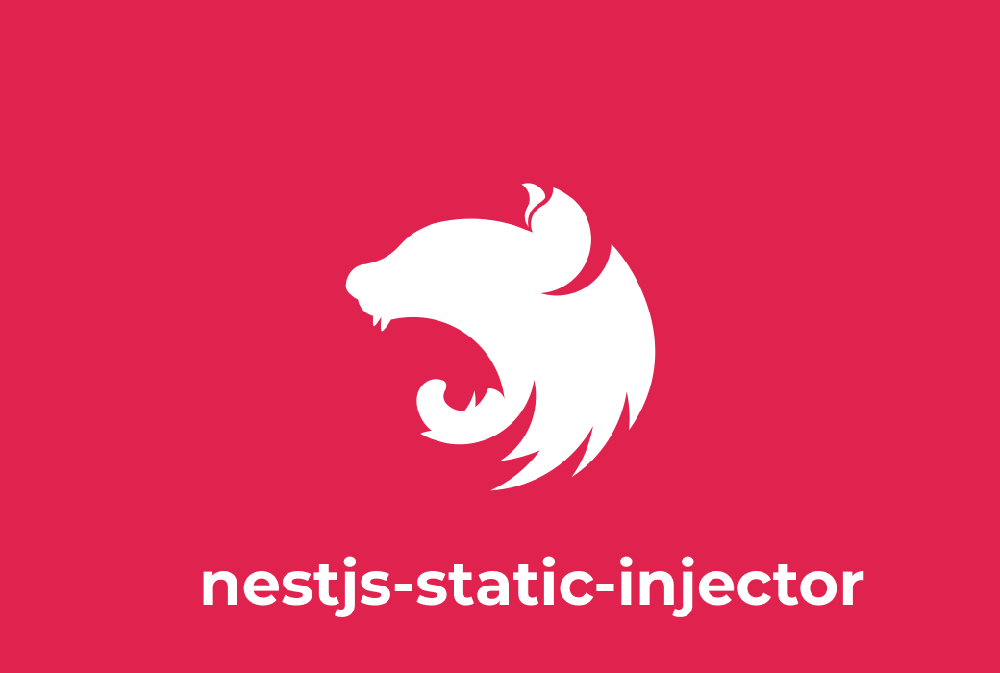

<p align="center">
  
</p>

<p align="center">
  <b>NestJS Static Injector - v1.0.0</b>
</p>

---

## Overview

This library solves a framework weakness of not having to statically access providers in the application, something that can be commonly used in decorators, as decorators are executed in the application compilation process and not during the code interpretation, that is, you cannot access providers by instance, this is one of the reasons for the existence of this library.

### Installation

```bash
# Using NPM
$ npm install @prats-tech/nestjs-static-injector

---

# Using Yarn
$ yarn add @prats-tech/nestjs-static-injector
```

### Examples/Reasons

```typescript
import { Module, MyService } from '@nestjs/common';

import { StaticModule } from '@prats-tech/nestjs-static-injector';

@Module({
  imports: [StaticModule],
  providers: [MyService],
  exports: [MyService],
})
class AppModule {}

@Injectable()
class MyService {
  execute() {
    // execute some logic
  }
}

function Decorator() {
  return function (target: any) {
    const service = StaticInjector.getInstance().get(MyService);
    service.execute();
  };
}

@Decorator()
class ClassThatWillUseTheDecorator {}
```

---

## License

MIT © [Prats](https://github.com/prats-tech)
